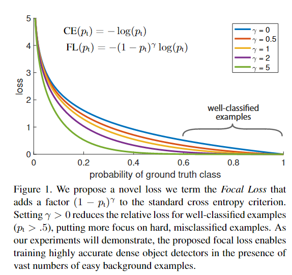
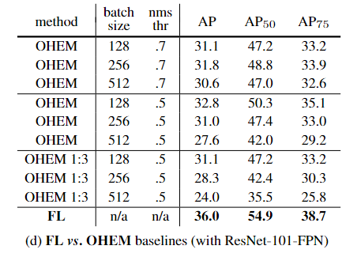

# Abstract

#### two-stage detector：先挑选出一系列的候选框，再根据候选框进一步调整、分类。精度高但是速度慢。Faster R-CNN,Mask R-CNN

#### one-stage detector：直接进行预测、回归、分类。速度快但是精度低。YOLO,SSD

#### one-stage detector在精度方面比不过two-stage detector。作者发现了其中的原因（extreme foreground-background class imbalance）。见下图：

#### 因此，作者根据标准的CE损失函数，推出了一个新的损失函数（Focal Loss）。目的是降低易分样本的权重，使难分样本的损失在总损失中占主导地位。为了证明该损失函数的有效性，作者搭建了一个新的detector（RetinaNet）。该detector不仅在速度上可以与现存的one-stage detector匹敌，而且在精度上超过了现有的SOTA(state-of-the-art)detector。

# Introduction

#### two-stage detector屡次在COCO数据集上刷新精度纪录，那么一个简单的one-stage detector能否实现相同的精度呢？随着YOLO,SSD的出现，缩小了one-stage detector与two-stage detector在精度上的的差距，作者认为one-stage在精度上追平two-stage随时有可能的。随着本篇文章的提出，one-stage detector首次在COCO数据集上的AP能够与two-stage detector媲美。为了得到这一结果，作者团队将 class imbalance 作为训练中影响one-stage detector准确率的主要障碍，并且提出了一个新的损失函数。

#### Class imbalance在R-CNN之类的two-stage detector中已经被解决了。是怎样解决的呢？在第一阶段(proposal-stage)，候选框已经通过(Selective Search,EdgeBoxes,DeepMask和RPN )等方法被缩减到1-2k个，过滤了大部分的背景样本。在第二阶段(classification stage)，采用固定前景与背景的比例（如1:3）或者online hard example mining (OHEM)维持一个合理的前景和背景的比例。（OHEM：通过在训练过程中动态地选择难分样本，以便更好地训练模型，提高对难分样本的适应性。）

#### 相反，one-stage detector直接从图片中采样，为了尽可能地覆盖整张图片，导致候选框的数量达到100k个。作者又说，使用two-stage第二阶段控制前景和背景的比例的方法无法有效解决这一问题。因此，作者提出了一个新的损失函数，该损失函数能显著降低易分样本的权重，即使在有大量易分样本存在的情况下，他们也不会主导最后的loss。应用该损失函数后的loss of examples如下图:

#### 为了证明该函数应用在one-stage detector中的有效性，作者设计了一个新的one-stage detector(RetinaNet)，该detetor以FPN和ResNet为backbone。与其他模型的比较见下图:

# Focal Loss

#### 首先登场的是cross entropy for binary classification(简称bCE)。p代表样本为正样本的概率

$$
bCE(p,y)=\begin{cases}
-log(p) &  y = 1 \\
-log(1-p) & y=0
\end{cases}
$$

$$
p_t=\begin{cases}
p & y=1\\
1-p & y=0
\end{cases}
$$

$$
bCE(p,y)=bCE(p_t)=-log(p_t)
$$

#### 从第二张图可以看出，对于易分样本，用bCE去计算loss，他们的loss仍然很大。常用的解决方法是引入权重因子 *α* 的方法，*α* 取值范围在 [0, 1]。对于正样本在bCE前面乘一个α,对于负样本乘一个(1-α)。做变换如下：

$$
α_t=\begin{cases}
α&y=1\\
1-α&y=0
\end{cases}
$$

#### 得到

$$
bCE(p_t)=-α_tlog(p_t)
$$

#### 作者将该损失函数作为实验的baseline

#### 在bCE函数中引入α后，虽然控制了正负样本的比例，但是它并不能区分难分样本与易分样本。因此，作者打算将bCE函数改造成能够降低易分样本权重的函数。为此，作者向bCE中加入了 modulating factor:

$$
(1-p_t)^{γ},γ\geq0
$$

#### 定义Focal Loss如下：

$$
FL(p_t)=-(1-p_t)^{γ}log(p_t)
$$

#### 从第二张图可以看到：当样本被错误分类且pt很小时（这代表该样本为难分样本）,modulating factor便会接近于1，几乎不影响loss。当pt -> 1时，modulating factor便会接近于0，这样便降低了易分样本的权重。在后面的实验中，作者得出结论γ=2时，效果最好。

#### 事实上，作者还引入了α。因为，在实验中，他们发现detector的精度有了略微提升。

# RetinaNet Detector

#### RetinaNet 是一个单一、统一的网络，由一个主干网络（backbone network）和两个任务特定的子网络组成。主干网络由ResNet和FPN构成，子网络由若干个卷积层堆叠而成。主干网络用于提取图像的特征，生成特征图。第一个子网络对主干网络生成的特征图进行卷积操作，以执行目标分类，最后输出关于目标类别的置信度分数。第二个子网络同样对主干网络生成的特征图进行卷积操作，执行边界框回归，输出每个边界框的坐标偏移，使得最终通过调整这些边界框可以更准确地包围目标。结构见下图：

## 1.Feature Pyramid Network Backbone

#### 作者用FPN作主干，旨在使网络能够从一张单一分辨率的图片中提取出不同尺度的特征，昨天应该讲过了。FPN的金字塔包含了从P3到P7共5个级别，其中 l 表示金字塔级别，Pl 的分辨率比输入低 2^l 倍。每个金字塔级别都具有256个通道（C = 256）。细节见下图：

#### C2,C3,C4,C5代表ResNet中每个残差块的最后一个输出。详细解释这张图............

## 2.Anchors

#### 从P3到P7，作者在每一层都用了 三种大小 * 三种宽高比 的 anchors,旨在让框更密集地覆盖图片。详见下图：

##### 对于每个锚点，分配了一个长度为 K 的独热向量（one-hot vector）作为分类目标，其中 K 是目标类别的数量。这个独热向量用于表示每个锚点的目标类别，其中对应于实际目标类别的项为 1，其他项为 0。对于每个锚点，还分配了一个包含 4 个元素的向量，用于表示边界框回归目标。这个向量表示了每个锚点与其分配的实际目标边界框之间的偏移量。目标的分配规则参考了区域生成网络（RPN）的方法，但进行了修改以适应多类别检测，并调整了阈值。具体而言，锚点会被分配到与其交并比（IoU）大于等于 0.5 的实际目标边界框。如果 IoU 在 [0, 0.4) 范围内，则将锚点分配为背景。每个锚点仅被分配到一个实际目标边界框，对应于该目标类别的独热向量中的相应项为 1，其他项为 0。如果一个锚点未被分配到任何实际目标边界框，即出现在 IoU 在 [0.4, 0.5) 范围内的情况，它在训练过程中将被忽略。

## 3.Classification Subnet

#### 分类子网络采用参数共享的方式，其目标是在每个空间位置为每个锚点（A个锚点）和每个目标类别（K个类别）预测目标存在的概率。该子网络连接在金字塔每一层的后面，接收具有C个通道的输入特征图，应用了四个 3 X 3 的卷积层，每一卷积层有C个filter，并跟有ReLU激活函数。经过这四个卷积层后，还要经过一个 3 X 3 的卷积层，该卷积层含有K*A个filter，并在最后跟有sigmoid激活函数。 

## 4.Box Regression Subnet

#### 边界框回归子网络与目标分类子网络并行工作，目的是对每个锚点（A个锚点）进行回归，计算锚点与附近实际目标边界框之间的偏移量。如果在该位置存在实际目标，则边界框回归子网络将学习如何调整锚点位置以更准确地拟合实际目标边界框。它与 Classification Subnet 是相似的，不同点在于，它的最后一个卷积层filter的个数是4A，因为它是对每个anchor进行回归，计算anchor与ground-truth之间的偏移量,对于每个锚点，这 4 个输出分别表示了相对于实际目标边界框的水平偏移、垂直偏移、宽度缩放和高度缩放。这些输出用于调整锚点位置以更好地匹配实际目标。两个子网络参数不共享。

# Experiments

#### 改变α对CE loss 的影响：

#### 改变γ对FL的影响：

#### 经过试验后，作者选取了他认为的最好的参数值（γ = 2.0 和 α = 0.25）

#### 为了进一步证明FL的作用，作者选择了使用默认的 ResNet101 600 像素模型，该模型是使用 γ = 2 训练的（在这个设置下获得了36.0的平均精度AP）。作者采用这个模型对大量随机图像进行测试，随机采样了大约 10^7 个负样本窗口和约 10^5 个正样本窗口。对于这些采样的样本，分别对正样本和负样本计算焦点损失（FL），并将损失标准化，使其总和为一。这个步骤的目的是得到标准化的损失值，从而可以对损失从最低到最高进行排序。通过对正样本和负样本的标准化损失进行排序，可以绘制累积分布函数（CDF）。CDF见下图：

#### 作者还将OHEM应用于one-stage detection中，并将实验结果与FL相比较。见下图：

#### RetinaNet与SOTA们的对比：

# Conclusion

1. **主要障碍的识别**：在这项研究中，作者确定了类别不平衡是阻碍一阶段目标检测器超越表现优异的两阶段方法的主要障碍。类别不平衡指的是不同类别的样本数量差异很大，导致模型在学习中偏向于出现频率较高的类别，而对于频率较低的类别学习不足。
2. **提出的解决方案 - 焦点损失**：为了解决类别不平衡的问题，作者提出了焦点损失（focal loss）。焦点损失在交叉熵损失的基础上引入了一个调制项，以便将学习的焦点集中在难以分类的负样本上。这一方法简单而高效。
3. **方法的有效性**：作者通过设计一个完全卷积的一阶段目标检测器来展示焦点损失的有效性。通过进行广泛的实验分析，他们报告了该方法实现了业界领先的准确性和速度。

# Dataset

#### coco2014:

train:http://images.cocodataset.org/zips/train2014.zip 

val:http://images.cocodataset.org/zips/val2014.zip 

test:http://images.cocodataset.org/zips/test2014.zip 

annotations:http://images.cocodataset.org/annotations/annotations_trainval2014.zip

#### vocal2012 :

http://host.robots.ox.ac.uk/pascal/VOC/voc2012/VOCtrainval_11-May-2012.tar

​                 
